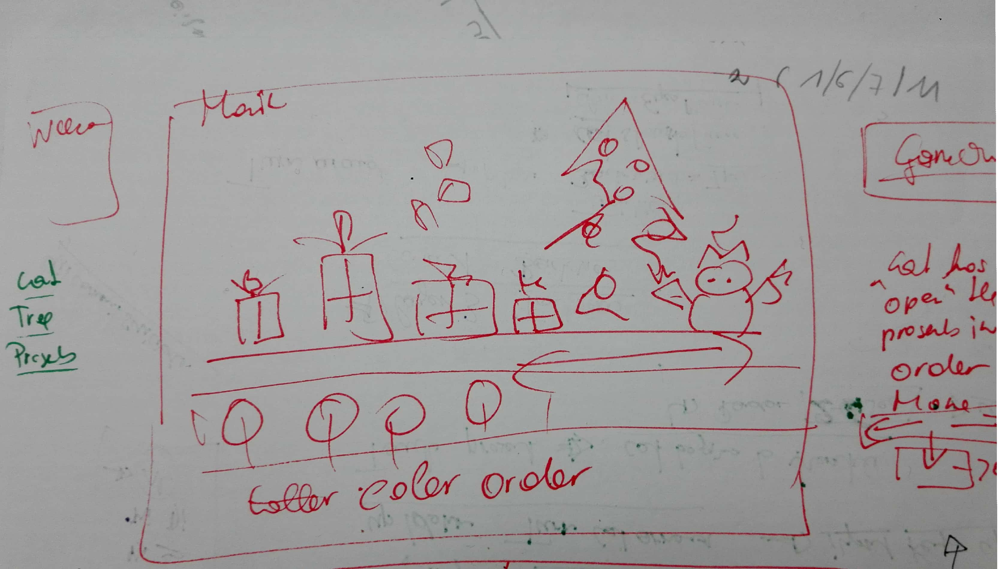
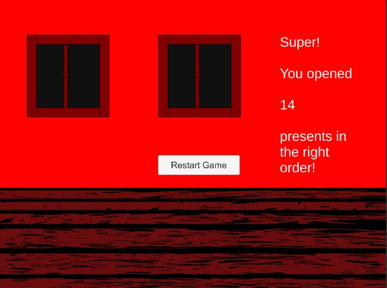
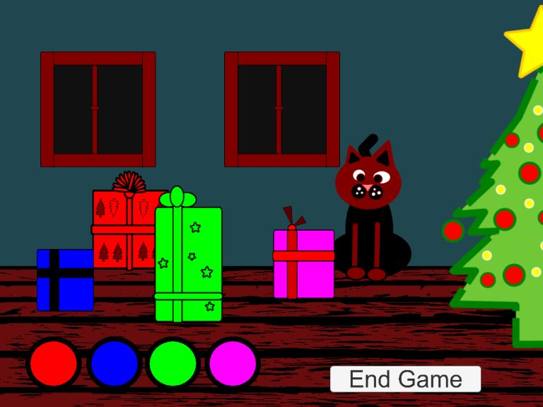
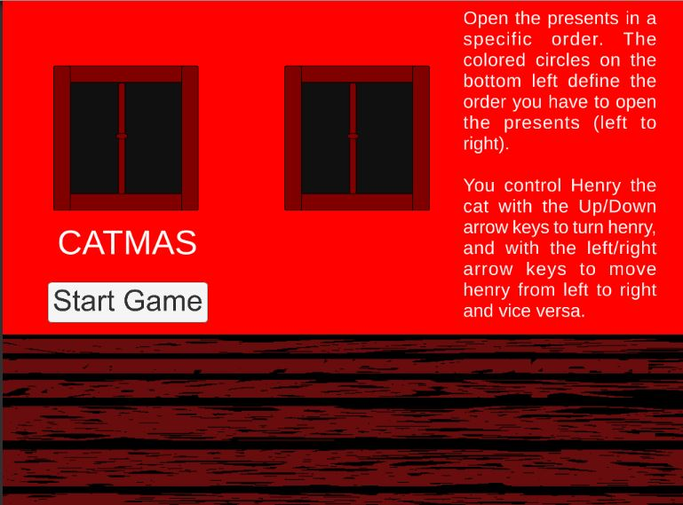

# The Catmas
Dev platform: Unity 2018.2.14f, Visual Studio 2017 Community version 15.9.3, Windows 10. Scripting Runtime Version .NET4.x Equivalent, API compatibility Lvel .NET Standard 2.0; 
Targest platform: WebGL (Referenz resolution: 1024 * 768)

The Catmas Game is a simple 2D game inspired by the 10-minute challenge of practicing 2D game development.
The cat must open gifts in the correct color sequence.
The order is shown at the bottom left.
The cat can be moved in the desired direction with the left and right arrow keys.
It can be rotated using the up and down arrow keys.
To open a gift, sit in front of the gift with the cat and wait.
At first, the kitten is excited (moving up and down) in front of the present.
If it's the right gift, the cat destroys the gift otherwise, it does nothing.

Shuffle List
https://stackoverflow.com/questions/273313/randomize-a-listt 
https://jamesshinevar.com/2017/05/28/shuffle-a-list-c-fisher-yates-shuffle/

Sound: Cat miow, lick, purr : 
+ https://freesound.org/people/Trautwein/sounds/260881/ (purr)
+ https://freesound.org/people/Hamface/sounds/98671/ (miow)
+ https://freesound.org/people/Hamface/sounds/98672/ (lick)

Open issues: 
+ add particles to open presents
+ adapt sound
+ adapt animations
+ add timer
+ add highscore
+ adapt game flow: e.g., additional timer, randomly changing colors during game, falling down staff etc. 

Topics Covered:
+ Singelton pattern
+ Using lists
+ Permutation for List Shuffle
+ Scenemanagement
+ Audio: at least 2 different AudioSources for playOneshot respectively play
+ Change sprite properties from script
+ Using TextMeshPro and access compontent from script to change text
+ Using Horizontal axis as input, using arrow keys up and down as input
